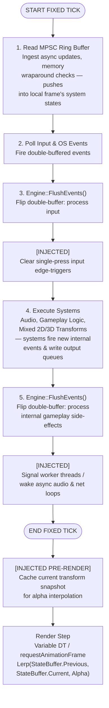

# Events

## Table of Contents

- [Introduction](#introduction)
- [The Event Bus](#the-event-bus)
    - [Synchronous Events](#synchronous-events)
    - [Async and Multi-threaded Events](#async-and-multi-threaded-events)
- [Architectural Design](#architectural-design)

## Introduction

There is information that needs to be delivered between naive systems, and that's what our event bus does. We trigger an event, and the necessary information is delivered to all relevant systems.

We abstract the event bus as if it runs in c++/OpenGL, in typescript. From there we create the functional equivalent to webGL.

## The Event Bus

There will be two ways we do eventing. Both Multi-Producer Single-Consumer (MPSC) chains and a Double-Buffered bus.

Not to be confused with web-based events, which are all asynchronous. With node engines, we have access to asynchronous javascript. While this may be useful for short term events, not every engine works like node or chromium. 

While we may consider and utilize asynchronous javascript, the consideration for multi-threading in c++ is a non-negotiable eventuality. Both a double-buffered event bus, and an additional MPSC event chain for async/multi-threading, will be useful for porting and learning.

### Synchronous Events

Synchronous double-buffered events allow for more predictability on the onset. Synchronous events will run per tick, which is currently set as `FIXED_DT` of a second (ticks per second). Simulation speed should not be directly tied into FPS. Synchronous events guarantee that every subscriber has received intended events which will allow for straight-forward debugging.

```javascript
const FIXED_DT = 1 / 60;
```

### Async and Multi-threaded Events

Async and multi-threaded eventing is helpful with heavier lifts such as saving/loading, networking/snapshots, asset loading/streaming, and the audio engine.

Considerations for multi-threading will also be made when we decide to utilize async event triggers. Since we're running both 2D and 3D in C++, this will not be a small lift. Our multi-threaded Pub/Sub event bus is in consideration for becoming a mix of double-buffered and lock-free ring buffered (MPSC Queue).

#### Double-buffered events

Double-buffered event queues are primarily useful for single-threaded frame phases or simple batch job swaps. The initial complexity is low, and allows for dynamic vector resizing as well as array swapping. The is potential for 'high contention' across threads and will require a Mutex lock. It works well with highly variable payload sizes.

They rely on pointer swapping, are entirely deterministic, and can be sorted before execution. We can control nitty gritty render events and maximize cache performance manually.

#### MPSC Queue

The lock-free ring buffer, or MPSC queue, is useful for multi-threaded, high frequency, communication between workers and the main game loop. The initial complexity is high, it requires atomic operations and memory order fencing. We'd need to pre-allocate our memory. Benefit to the high complexity is that there would be no thread contention, since we'd be using lock-free pointers. Memory management can be painful, we might suffer from buffer overflow with a naive implementation, we'll need to watch that our consumers don't lag behind our producers.

These are non-blocking. Some systems will want to broadcast events without waiting on the main gameloop to recognize them. We don't need to worry about byte memory management, since we pre-allocate at startup. Our arrays and heaps won't need to dynamically resize or clear and pause the engine.

We can't easily sort pre-execution, we absolutely have to process them sequentially.

## Architectural Design

Proposed flow



## Proposed Implementation

### State management

```text
[ START FIXED TICK ]
   │
   ├── 1. Cache History ───> StateBuffer.Previous = StateBuffer.Current  (Zero-allocation pointer swap)
   │
   ├── 2. Simulate ────────> Run Systems ──> Mutates StateBuffer.Current
   │
[ END FIXED TICK ]
   │
   └── 3. Render Pass ─────> Lerp(StateBuffer.Previous, StateBuffer.Current, Alpha) ──> WebGL Draw
```

## Navigation

- **[Index](INDEX.md)** - Project overview and documentation index
- **[Portability Rules](portability-rules.md)** - All portability enforcement rules and constraints
- **[Architecture](architecture.md)** - High-level architecture, design principles, and platform strategy
- **[Rendering](rendering.md)** - Rendering system, lighting, and day/night cycle
- **[State Management](state-management.md)** - State Management considerations
- **[Camera](camera.md)** - Camera system and mathematical formulas
- **[Systems](systems.md)** - World, party, input, collision, and geometry systems
- **[Data Formats](data-formats.md)** - Data format specifications
- **[Project Structure](project-structure.md)** - Code organization and project structure
- **[Porting Strategy](porting-strategy.md)** - Porting approach, FFI constraints, and learning path
