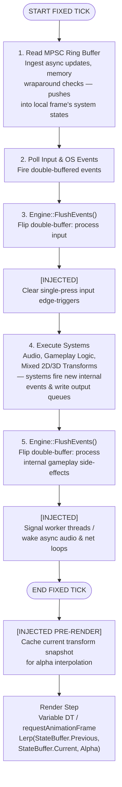

# Eventing, State, and Audio Systems

## Table of Contents

- [Introduction](#introduction)
- [Architectural Design](#architectural-design)
- [Proposed Implementation](#proposed-implementation)
    - [The Event Bus](#the-event-bus)
        - [Synchronous Events](#synchronous-events)
        - [Async and Multi-threaded Events](#async-and-multi-threaded-events)
        - [Double-buffered events](#double-buffered-events)
        - [MPSC Queue](#mpsc-queue)
    - [Global State management](#global-state-management)
    - [Audio Systems](#audio-systems)
- [Pitfalls to Avoid](#pitfalls-to-avoid)
- [Navigation](#navigation)

## Introduction

There is information that needs to be delivered between naive systems, and that's what our event bus does. We trigger an event, and the necessary information is delivered to all relevant systems.

We abstract the event bus as if it runs in c++/OpenGL, in typescript. From there we create the functional equivalent to webGL.

## Architectural Design

Proposed flow


```mermaid
flowchart TB
    Start(["START FIXED TICK"]) --> MPSC

    MPSC["1. Read MPSC Ring Buffer<br/>Ingest async updates, memory<br/>wraparound checks — pushes<br/>into local frame's system states"] --> Poll

    Poll["2. Poll Input &amp; OS Events<br/>Fire double-buffered events"] --> Flush1

    Flush1["3. Engine::FlushEvents()<br/>Flip double-buffer: process input"] --> EdgeClear

    EdgeClear["[INJECTED]<br/>Clear single-press input edge-triggers"] --> Systems

    Systems["4. Execute Systems<br/>Audio, Gameplay Logic,<br/>Mixed 2D/3D Transforms<br/>— systems fire new internal<br/>events &amp; write output queues"] --> Flush2

    Flush2["5. Engine::FlushEvents()<br/>Flip double-buffer: process<br/>internal gameplay side-effects"] --> Signal

    Signal["[INJECTED]<br/>Signal worker threads /<br/>wake async audio &amp; net loops"] --> End

    End(["END FIXED TICK"]) --> Snapshot

    Snapshot["[INJECTED PRE-RENDER]<br/>Cache current transform snapshot<br/>for alpha interpolation"] --> Render

    Render["Render Step<br/>Variable DT / requestAnimationFrame<br/>Lerp(StateBuffer.Previous,<br/>StateBuffer.Current, Alpha)"]
```

## Proposed Implementation

### The Event Bus

There will be two ways we do eventing. Both Multi-Producer Single-Consumer (MPSC) chains and a Double-Buffered bus.

Not to be confused with web-based events, which are all asynchronous. With node engines, we have access to asynchronous javascript. While this may be useful for short term events, not every engine works like node or chromium. 

While we may consider and utilize asynchronous javascript, the consideration for multi-threading in c++ is a non-negotiable eventuality. Both a double-buffered event bus, and an additional MPSC event chain for async/multi-threading, will be useful for porting and learning.

```typescript
type Event = {
   type: 'mode_changed';
   previousMode: 'world_3d' | 'scene_2d';
   currentMode: 'world_3d' | 'scene_2d';
}
```

Events will be explicitly typed. We'll subscribe listeners in the main logic, and will publish events in the game loop. Events will not affect state directly, subscribers will call event handlers per system as-required.

```typescript
interface EventBus {
    publish(event: Event): void;

    subscribe<K extends Event['type']>(
        type: K,
        handler: (event: ExtractEvent<K>) => void,
    ): () => void;
}
```

#### Synchronous Events

Synchronous double-buffered events allow for more predictability. Synchronous events will run per tick, which is currently set as `FIXED_DT` of a second (ticks per second). Simulation speed should not be directly tied into FPS. Synchronous events guarantee that every subscriber has received intended events which will allow for straight-forward debugging.

```javascript
const FIXED_DT = 1 / 60;
```

The typescript implementation will begin as synchronous until multi-threading becomes apparent. We would LIKE to avoid creating web-based service workers to imitate an actual c++ implementation. That would increase the breadth and scope of the project, and while service workers are incredibly useful for PWAs, we have no server. Sheerly imitating multi-threaded c++ isn't the goal, creating something port-forward is. Aside from the increased complexity, we're not facing the high-volume per millisecond calculations that would require several javascript threads.

The Event bus itself starts out synchronous and simple. Events should be both subscribable and unsubscribable.

```typescript
interface EventBus {
    publish(event: Event): void;

    subscribe<T extends Event>(
        type: T['type'],
        handler: (event: T) => void,
    ): () => void;
}
```

To avoid execution stalls, 

#### Async and Multi-threaded Events

Async and multi-threaded eventing is helpful with heavier lifts such as saving/loading, networking/snapshots, asset loading/streaming, and the audio engine.

Considerations for multi-threading will also be made when we decide to utilize async event triggers. Since we're running both 2D and 3D in C++, this will not be a small lift. Our multi-threaded Pub/Sub event bus is in consideration for becoming a mix of double-buffered and lock-free ring buffered (MPSC Queue).

#### Double-buffered Queue

Double-buffered event queues are primarily useful for single-threaded frame phases or simple batch job swaps. The initial complexity is low, and allows for dynamic vector resizing as well as array swapping. The is potential for 'high contention' across threads and will require a Mutex lock. It works well with highly variable payload sizes.

They rely on pointer swapping, are entirely deterministic, and can be sorted before execution. We can control nitty gritty render events and maximize cache performance manually.

Generic Double-buffered event queue with synchronous dispatch:

```typescript
export class TypeSafeEventBus implements EventBus {
    private listeners = new Map<string, Array<(event: any) => void>>();

    private incomingQueue: Event[] = [];

    private processingQueue: Event[] = [];

    publish(event: Event): void {
        this.incomingQueue.push(event);
    }

    flush(): void {
        if (this.incomingQueue.length === 0) return;

        this.processingQueue = this.incomingQueue;
        this.incomingQueue = [];

        for (let i = 0; i < this.processingQueue.length; i += 1) {
            const event = this.processingQueue[i];
            const handlers = this.listeners.get(event.type);
            if (handlers) {
                for (let j = 0; j < handlers.length; j += 1) {
                    handlers[j](event);
                }
            }
        }

        this.processingQueue = [];
    }

    subscribe<K extends Event['type']>(
        type: K,
        handler: (event: ExtractEvent<K>) => void,
    ): () => void {
        if (!this.listeners.has(type)) {
            this.listeners.set(type, []);
        }

        const handlers = this.listeners.get(type)!;
        handlers.push(handler);

        return () => {
            const currentHandlers = this.listeners.get(type);
            if (!currentHandlers) return;

            this.listeners.set(
                type,
                currentHandlers.filter((h) => h !== handler),
            );
        };
    }
}
```

#### MPSC Queue

The lock-free ring buffer, or MPSC queue, is useful for multi-threaded, high frequency, communication between workers and the main game loop. The initial complexity is high, it requires atomic operations and memory order fencing. We'd need to pre-allocate our memory. Benefit to the high complexity is that there would be no thread contention, since we'd be using lock-free pointers. Memory management can be painful, we might suffer from buffer overflow with a naive implementation, we'll need to watch that our consumers don't lag behind our producers.

These are non-blocking. Some systems will want to broadcast events without waiting on the main gameloop to recognize them. We don't need to worry about byte memory management, since we pre-allocate at startup. Our arrays and heaps won't need to dynamically resize or clear and pause the engine.

We can't easily sort pre-execution, we absolutely have to process them sequentially.

### Global State management

State is changing information which the engine utilizes to make determinations. Our pub / sub event service, system simulations, and global state complement one and another. State is authoritative simulation data. It is not responsible for broadcasting changes.

Systems may contain their own state. Accessing protected system data/state may change, but if state is not global, it is protected. Whether through events or public getters, protected state can be returned in different ways until patterns emerge. Trade-offs will be considered from there.

We have both state and a state buffer. True global state will live in the buffer. Cache will be computed from state, but never be stored or lerped independently.

The collision grid and world chunks are excluded from global state, purposefully. Since it's content and non-reliant on our simulated engine time, there's no benefit.

There's a current differentiation between discrete and interpolated state. Discrete state is directly copied. It's "true" state.

Interpolated state includes "in-between" values for other calculations/events that need to be free and unblocked. Per tick the interpolation may be running at 144 Hz vs a set 60Hz simulation speed. This allows for frame rates to be ran independently of the in-game engine.

```typescript
export interface State {
    interpolated: InterpolatedState;
    discrete: DiscreteState;
}
```

Initial implementation assumes game state will be updated per tick, rendering will handle Lerping separately. Constraints may be determined or elaborated as we progress.

```text
[ START FIXED TICK ]
   │
   ├── 1. Cache History ───> StateBuffer.Previous = StateBuffer.Current  (Zero-allocation pointer swap)
   │
   ├── 2. Simulate ────────> Run Systems ──> Mutates StateBuffer.Current
   │
[ END FIXED TICK ]
   │
   └── 3. Render Pass ─────> Lerp(StateBuffer.Previous, StateBuffer.Current, Alpha) ──> WebGL/OpenGl Draw
```

### Audio Systems

Audio needs to be playable, pauseable, streamable, and stopable. For game engines requiring low latency and precision playback, the ideal strategy is to fetch audio files as an binary ArrayBuffer, decode them into a raw PCM AudioBuffer, and store that as our internal platform-agnostic type.


```text
Individual PCM Playback Voice (e.g., SFX Effect)
               │
               ▼
         [sfxGainNode]       [uiGainNode]      [musicGainNode]
              │                    │                  │
              └───────────┬────────┴──────────────────┘
                          ▼
                   [masterGainNode]
                          │
                          ▼
                 [Hardware Speakers]
```

With consideration for multiple sound types and volume, we'll need to consider support for audio categories and or mix buses.

```typescript
export type AudioCategory = 'master' | 'sfx' | 'music' | 'ambient' | 'ui'; // Preparation for mixing engine separation of concerns

export interface AudioService { // Core service
    play(sound: SoundHandle, category?: AudioCategory): PlaybackHandle;
    setVolume(category: AudioCategory, volume: number): void;
    getVolume(category: AudioCategory): number;
}

interface SoundHandle { // Pointer to fully loaded sound asset
    readonly id: string;
}

interface PlaybackHandle { // Execution token representing a live and/or active audio-clip.
    pause(): void;
    resume(): void;
    stop(): void;
}
```

Smaller sound files, that are loaded globally (menu movement, menu selection, etc..), will be loaded on engine-load. Less common sound filed will be loaded dependent on criteria as patterns emerge. Larger sound files will be considered for streaming.

```typescript
interface AssetLoader {
    loadSound(soundUrl: string): Promise<SoundHandle>;
}

class SoundRegistry { // Human readable registry
    private cache = new Map<string, SoundHandle>();

    public register(id: string, handle: SoundHandle): void {
        this.cache.set(id, handle);
    }

    public get(id: string): SoundHandle | undefined {
        return this.cache.get(id);
    }
}
```

Using the event bus for a short sound:

```typescript
eventBus.subscribe('do_the_thing', () => audioService.play(doTheThing));
```

#### Web Audio

We will need to do a bit of heavy lifting to pack the audio buffers and context specifics  into our own class layer. For game engines requiring low latency and precision playback, the ideal strategy is to fetch audio files as an binary ArrayBuffer, decode them into an AudioBuffer, and store that as an internal type.

```typescript
export class WebSoundHandle implements SoundHandle {
    // Hidden from core: contains the raw PCM array decompressed in RAM
    public readonly buffer: AudioBuffer;
    public readonly id: string;

    constructor(id: string, buffer: AudioBuffer) {
        this.id = id;
        this.buffer = buffer;
    }
}

```

The web platform additionally requires renewing source nodes upon resumption.

```typescript
export class WebPlaybackHandle implements PlaybackHandle {
    //...
    public resume(): void {
        if (this.isPlaying) return;
        if (this.pauseOffset < this.buffer.duration) {
            this.start(this.pauseOffset);
        }
    }
}
```

Our platform layer uses type-casting internally to unpack safely when the core engine passes abstract handles back down.

```typescript
export class WebAudioService implements AudioService {
    //...
    public play(sound: SoundHandle): PlaybackHandle {
        // Safe Downcast
        const webSound = sound as WebSoundHandle;
        
        if (!webSound.buffer) {
            throw new Error(`Invalid asset passed to WebAudioService: ${sound.id}`);
        }

        return new WebPlaybackHandle(this.ctx, webSound.buffer);
    }
}
```

## Pitfalls to Avoid

1. Events indicate what happened, not what should happen. Keep payloads informational, do not pack direct mutations.
2. Immediate handlers create execution stalls. Subscribers handle tasks lazily or queue them.
3. Avoid buffer volatility. Decompressing files into memory scales footprints significantly. Large ambient tracks or background music loops must be routed via streaming targets instead of being cached.

## Navigation

- **[Index](INDEX.md)** - Project overview and documentation index
- **[Portability Rules](portability-rules.md)** - All portability enforcement rules and constraints
- **[Architecture](architecture.md)** - High-level architecture, design principles, and platform strategy
- **[Rendering](rendering.md)** - Rendering system, lighting, and day/night cycle
- **[Camera](camera.md)** - Camera system and mathematical formulas
- **[Systems](systems.md)** - World, party, input, collision, and geometry systems
- **[Data Formats](data-formats.md)** - Data format specifications
- **[Project Structure](project-structure.md)** - Code organization and project structure
- **[Porting Strategy](porting-strategy.md)** - Porting approach, FFI constraints, and learning path
